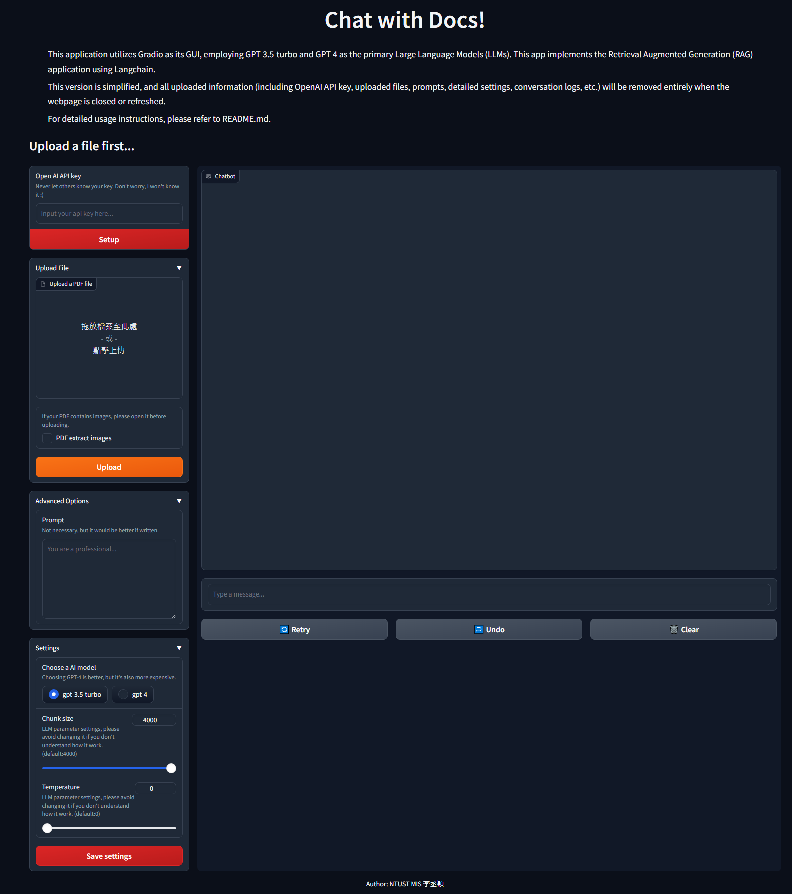

# Chat with Docs - simple ver.

This version is a simplified edition of the original, lacking any data retention features, suitable for testing and short-term use.

## Installtion

```shell
$ cd Retrieval-augmented-generation--Chat-With-Docs

$ python -m venv .venv

$ source .venv/bin/activate
(.venv)$ pip install -r ./requirements.txt
```

## Run

```shell
(.venv)$ python src/simple_version/main.py
```

## How to Use

1. Enter the key you possess.
2. Upload the PDF to be retrieved.
3. Ask your assistant questions.
4. You can extend more features using "Advanced Options."
5. You can modify the parameters in "Settings" to adjust your model.


